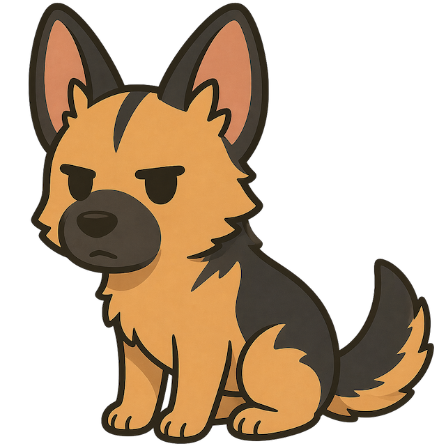

# Shepherd

Slack-native ticket management for team workflows — messages become tickets, threads become conversations.

<p align="center">
  
</p>

[](https://github.com/m-mizutani/shepherd/actions/workflows/ci.yml)
[](https://github.com/m-mizutani/shepherd/actions/workflows/lint.yml)
[](https://github.com/m-mizutani/shepherd/actions/workflows/gosec.yml)
[](https://github.com/m-mizutani/shepherd/actions/workflows/trivy.yml)

## Overview

Shepherd turns Slack channels into lightweight ticket queues. New messages in a monitored channel automatically create tickets; thread replies become ticket comments. Status changes are notified back to the thread as context blocks.

- **Slack-first** — Tickets are created from Slack messages, status updates flow back to threads
- **Workspace-based** — Multiple independent workspaces, each with its own channel, statuses, and custom fields
- **Web UI** — React SPA for managing tickets, configuring workspaces, and tracking status
- **Single binary** — Frontend is embedded into the Go binary via `go:embed`

## Tech Stack

| Layer | Technology |
|-------|-----------|
| Backend | Go (chi/v5, goerr/v2, urfave/cli/v3) |
| Frontend | TypeScript, React, Vite, Tailwind CSS, shadcn/ui |
| API | OpenAPI-first (oapi-codegen + openapi-typescript) |
| Database | Firestore (+ in-memory backend for development) |
| Auth | Slack OIDC (+ `--no-authn` dev mode) |
| Error tracking | Sentry |

## Quick Start

```bash
# Development mode (in-memory DB, no auth)
shepherd serve --no-authn U_DEV --repository-backend memory --config examples/config.toml
```

See [docs/slack.md](docs/slack.md) for Slack app setup.

## License

Apache License 2.0
